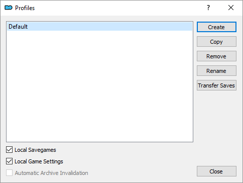
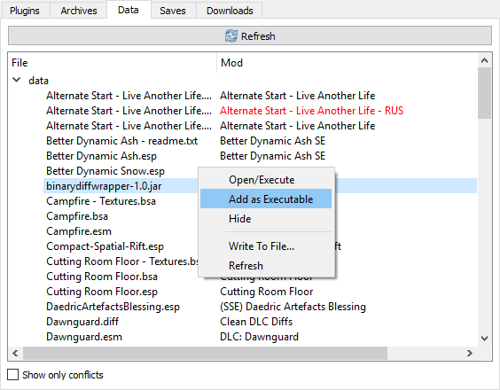

# Общий порядок действий

> Это практически самый короткий путь начать играть. Данные рекомендации помогут тебе разобраться с ваниллой для того, чтобы начать ставить на неё моды по своему вкусу. Путь, указанный здесь, может подойти не каждому, так что сначала пробегись взглядом по написанному и реши, следовать ли ему. Кроме того, существуют [Зарубежные гайды](), в которых тоже много полезной информации.

## Содержание
+ [Скачивание/установка игры](#DownloadInstall)
+ [Дополнительные программы](#SkyrimTools)
+ [Подготовка игры](#Preparation)
+ [Запуск игры](#StartGame)
+ [Полезные советы](#GoodTips)

##  Скачивание/установка игры

1) Для начала убедись, что вычистил все следы предыдущей установки (если она была). Проверь папки Стима или куда ты ещё устанавливал Скайрим, проверь "Документы\My Games". Проверь установленные программы через Панель Управления или Reg Organizer или любую подобную софтину, вдруг он висит в списке.

2) Теперь выбор версии игры.
    + Если ставишь пиратку, убедись в её "нормальности". Версия должна быть 1.5.39 вместе со всеми DLC - Dawnguard, Hearthfire, Dragonborn. Не должно быть больше ничего. Никаких предустановленных модов, фиксов и подобного.
    + Если ставишь Steam-версию, то просто не промахнись с языком (ПКМ ➔ Свойства ➔ Язык). Учти, что ссылки данной шапки почти всегда ведут на англоязычные ресурсы, поэтому при выборе русского языка поиском локализованных модов ты должен будешь заниматься самостоятельно.

3) Установку желательно проводить не на диск C. Нужен какой-нибудь D, E или где ты там держишь игрушки. Если ставишь пиратку, подойдёт "E:\Games", если из Стима - "E:\Steam Library". Поверь, это не спроста, на диске C (особенно в Program Files) часто возникают проблемы с правами записи. Для гайда будем считать, что ты ставишь SSE из Стима.

##  Дополнительные программы

1) Первое, что я хотел бы сказать: не рекомендую скачивать эти программы с русских сайтов типа Gamer-Mods, ModGames и подобных. Кто знает, что они там навертели в настройках? Такое бывает довольно часто, васяны любят впаривать людям своевольно настроенный софт.

2) Этот софт можно спокойно качать, пока игра устанавливается, только не запускай. От себя я рекомендую Portable-версии, которые легче запихнуть в любую папку. Так и сделай: создай папку типа "E:\Games\Skyrim SE Tools", куда будешь кидать всё для работы с игрой.

3) Программы, используемые в данном гайде. Напоминаю, это не обязательный для всех список, всё дело в удобстве и обучении.
    + [**Mod Organizer 2**](https://www.nexusmods.com/skyrimspecialedition/mods/6194) - менеджер модов с относительно продвинутой системой виртуализации, который в будущем может не раз спасти твою сборку от тотального захламления и поломки.
    + **Опционально** ➔ [**BethINI**](https://www.nexusmods.com/skyrimspecialedition/mods/4875/) - программа для настройки инишников (файлов конфигурации), весьма полезная вещь.
    + **Опционально** ➔ [**LOOT**](https://github.com/loot/loot/releases/latest) - сортировщик плагинов и не только. Может указать тебе на плагины, в которых есть ошибки - так называемые "грязные записи".
    + **Опционально** ➔ [**SSEEdit**](https://www.nexusmods.com/skyrimspecialedition/mods/164/) - программа для простого редактирования плагинов и относительно автоматической очистки их от "грязных записей", которые покажет LOOT.

4) Эти программы лучше расположить по своим папкам в "E:\Games\Skyrim SE Tools". Типа "E:\Games\Skyrim SE Tools\BethINI", "E:\Games\Skyrim SE Tools\LOOT" и т.д. И пока Скайрим у тебя не установлен, не запускай их.

5) Mod Organizer 2 - программа особенная, использует для работы довольно спорный метод - перехват запросов системы. Из-за этого некоторые антивирусы могут мешать работе если не самого MO2, то некоторых приложений, запущенных из него. Добавь всю папку MO2 в список исключений своего антивируса. Если хочешь - сделай то же самое с папкой игры. Проверь также, чтобы у них обеих не стояла галка "Только чтение" (такого быть не должно, но вдруг).

**Внимание**: следование этим рекомендациям не освобождает от необходимости изучения инструкций к программам.

##  Подготовка игры

1) Запусти Лаунчер игры. Если ты не создал его ярлык на Рабочем столе, иди по адресу "E:\Steam Library\steamapps\common\Skyrim Special Edition" и запусти SkyrimSELauncher.exe. Дождись, пока он определит настройки графики для твоего ПК. Если хочешь, поправь нужные параметры сам.

2) Теперь закрой Лаунчер и проверь путь "Документы\My Games" - там должна оказаться папка "Skyrim Special Edition", а в ней 2 файла - Skyrim.ini и SkyrimPrefs.ini. Если они есть, то пока что всё идёт нормально.

3) Запусти Mod Organizer 2, обязательно от имени администратора. Выбери Portable-вариант и укажи игру "Skyrim Special Edition". Пройди небольшую обучалку и по возможности запомни её, она довольно важна, т.к. MO2 требует некоторых навыков в обращении с ним.

4) Открой "Tools ➔ INI Editor" и убедись, что инишники игры скопировались из Документов в MO2. Теперь он будет использовать именно их. По желанию можешь зайти в настройки текущего профиля и поставить галочку "Local Savegames".

    

5) Не забудь расположить DLC в верном порядке. Сверху вниз: Dawnguard ➔ HearthFires ➔ Dragonborn.

<b>
🔷 Действия ниже опциональны 🔷
</b>

6) Закрой MO2 и запусти BethINI для донастройки INI-файлов в MO2.
    + Выбери игру "Skyrim Special Edition" и иди на вкладку Setup. Проверь, чтобы там были правильно заполнены строки Game, Game Path и Mod Organizer. При правильно указанном пути к MO2 в строке INI Path можно будет выбрать профиль, для которого ты будешь настраивать инишники. Выбери текущий профиль.
    + Далее перейди обратно на вкладки настроек и измени всё так, как тебе нужно.
    + Вернись на вкладку Basic и кликни на "Save and Exit".
    + В дальнейшем ты можешь изменять инишники через BethINI (во время этого MO2 должен быть закрыт) или INI-редактор MO2, у него для каждого профиля свой набор файлов.

7) Добавь используемые тобой программы в список MO2. Это нужно для того, чтобы они могли видеть моды, установленные через него. Нажми на 2 шестерёнки слева вверху и добавь LOOT и SSEEdit.

    > Вообще, все программы, которые обращаются к модам в процессе работы, должны запускаться через МО2. И небольшой совет на будущее: если тебе нужно добавить в МО2 программу, которая была установлена через него (это может быть FNIS или любой исполняемый файл), проще это сделать через вкладку Data прямо в МО2.

    

    > Как ты понимаешь, BethINI к таким программам не относится, т.к. она не обращается к модам - только к INI-файлам. Если ты запустишь её из MO2 и попытаешься изменить инишники в текущем профиле, у тебя просто ничего не получится - настройки не будут сохраняться. TL;DR - сначала закрывай MO2, потом запускай BethINI.

8) Запусти LOOT через МО2 и убедись, что в плагинах DLC полно "грязных записей". Чтобы исправить это, сделай следующее:
    + запусти SSEEdit через МО, выбери один Update.esm, дождись конца загрузки (Background Loader: finished).
    + в левой части ПКМ по Update.esm ➔ Apply Filter for Cleaning, дождись окончания операции.
    + снова ПКМ ➔ Remove "Identical to Master" records, подтверди изменения в файле.
    + снова ПКМ ➔ Undelete and Disable References.
    + закрой SSEEdit, сохраняя изменённый Update.esm. По желанию можешь сделать бэкап - поставь галку Backup plugins.
    + повтори эти операции для каждого плагина DLC, а для Dawnguard - 2 раза. Да, 2 раза, такая вот морока.
    + если после всего в папке Overwrite MO2 у тебя появятся чистые плагины DLC и папка с бэкапами, создай из них мод (ПКМ по Overwrite ➔ Create Mod) и назови его "Cleaned DLC" или как-то похоже. Помести его первым в списке, а когда активируешь - не забудь снова про порядок загрузки.

9) Снова запусти LOOT и убедись, что теперь с плагинами всё в порядке.

<b>
🔷 Действия выше опциональны 🔷
</b>

10) Установка SKSE64. Очень важная штука, которая требуется для многих модов.
    + Для начала закрой МО2.
    + Затем скачай 7z-архив "Current SE build" по [этой ссылке](http://skse.silverlock.org/), открой его и возьми 3 файла:

        > skse64_1_5_39.dll  
        > skse64_loader.exe  
        > skse64_steam_loader.dll

        Запихни их в папку с игрой, где лежит SkyrimSE.exe.
    + Теперь снова запусти МО2 и убедись, что в его списке исполняемых файлов появился SKSE.
    + Также тебе надо установить некоторые файлы SKSE64 через МО2 как обычный мод. Для МО2 этот архив не совсем правильный, но это фиксится установкой папки Data как Data.

        

11) Довольно важный бонус SKSE64 - это файл SKSE.ini. Скачай его [отсюда](https://www.nexusmods.com/skyrimspecialedition/mods/1651) и просто поставь через МО2.

12) Довольно важный мод - Unofficial Skyrim Special Edition Patch или USSEP. Неофициальный патч, который исправляет многие баги. Для английских игроков версия [здесь](https://www.nexusmods.com/skyrimspecialedition/mods/266/), для русских можно взять на [Gamer-Mods](https://gamer-mods.ru/load/skyrim_se/patchi/ussep/153-1-0-4756) или [TESAll](http://tesall.ru/files/file/8682-neoficialnyy-patch-dlya-skyrim-special-edition-patch-ussep/).

    > Если ты начал игру без USSEP и поставил его среди прохождения, то есть вероятность того, что он не пофксит встреченный тобой баг, хотя должен. Многие баги оседают в сохранениях, поэтому установка (не обновление) USSEP рекомендует новую игру.

13) Другой значимый мод - SSE Fixes, который исправляет кое-что в коде игры. Если вкратце, то чем больше у вас плагинов, тем сильнее падает FPS в определённых локациях. Причём совершенно безосновательно - плагины могут быть вообще пустышками.
    + Найдите в корне игры файл "binkw64.dll" и переименуйте его в "binkw64_.dll" (да, именно так).
    + Установите [DLL Plugin Loader](https://www.nexusmods.com/skyrimspecialedition/mods/10546).
    + Установите [SSE Fixes](https://www.nexusmods.com/skyrimspecialedition/mods/10547).

##  Запуск игры

1) У тебя есть 2 способа запуска игры.
    + Первый - запускать МО2, запускать SKSE64 через МО2.
    + Второй - создать ярлык SKSE64 на Рабочем столе через МО2, запускать SKSE64 через него.

2) Если ты нигде не ошибся, стартовая сцена начинается нормально, повозка едет как надо, а конокрад молится Богам, то... можешь выйти из игры и начать накатывать моды. Не забывай читать описания, думать головой и ставить их только через МО2.

##  Полезные советы

1) Чтобы избавиться от квадратов в консоли, установи [SSE Russian Fix](https://www.nexusmods.com/skyrimspecialedition/mods/887/).

2) Движок игры сбоит при FPS больше 60, поэтому последний нужно ограничить. Можешь настроить это в BethINI или NVIDIA Inspector, включить вертикальную синхронизацию любым удобным способом - что даст лучший результат, то и используй.

------

|[*Назад к оглавлению*](../01_Оглавление.md)|
|:---:|
