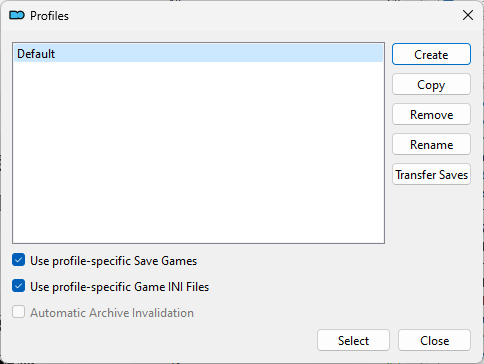
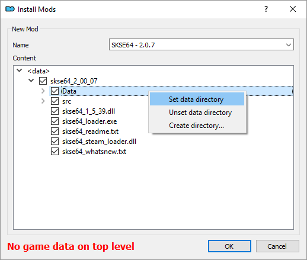

# Общий порядок действий (1.6.X)

> Это практически самый короткий путь начать играть. Данные рекомендации помогут тебе разобраться с ваниллой для того, чтобы начать ставить на неё моды по своему вкусу. Путь, указанный здесь, может подойти не каждому, так что сначала пробегись взглядом по написанному и реши, следовать ли ему. Кроме того, существуют [Гайды и подборки модов](04_Гайды_и_подборки_модов.md), которые охватывают куда больше аспектов моддинга.

## Содержание
+ [Скачивание/установка игры](#download-install)
+ [Дополнительные программы](#skyrim-tools)
+ [Подготовка игры](#preparation)
+ [Запуск игры](#start-game)
+ [Полезные советы](#good-tips)

##  Скачивание/установка игры

1) Для начала убедись, что вычистил все следы предыдущей установки (если она была). Проверь папки Steam или куда ты ещё устанавливал Скайрим, проверь "Документы\My Games". Проверь установленные программы через Панель Управления или Reg Organizer или любую подобную софтину, вдруг он висит в списке.

2) Теперь выбор версии игры.
    + Если ставишь пиратку, убедись в её "нормальности". Версия должна быть 1.6.640 типа Steam-Rip, Anniversary Upgrade/Edition по желанию. Не должно быть больше ничего. Никаких предустановленных модов, фиксов и подобного.
    + Если устанавливаешь игру из Steam, то просто не ошибись с языком: ПКМ ➔ Свойства ➔ Язык ➔ Русский.

3) Установку желательно проводить за пределами действия UAC. Подойдёт не только диск D, E или где ты там держишь игрушки, можно использовать "C:\Games". Поверь, это не спроста, из-за UAC в Program Files часто возникают проблемы с правами записи. Установка на SSD значительно уменьшит время загрузок, подумай над этим. Для гайда будем считать, что ты ставишь игру из Steam, а проблема с UAC уже решена (например, [ты вытащил всю библиотеку из Program Files](https://support.steampowered.com/kb_article.php?ref=7418-YUBN-8129)).

##  Дополнительные программы

1) Первое, что я хотел бы сказать: не рекомендую скачивать эти программы с русских сайтов типа Gamer-Mods, ModGames и подобных. Кто знает, что они там навертели в настройках? Такое бывает довольно часто, васяны любят впаривать людям своевольно настроенный софт.

2) Этот софт можно спокойно качать, пока игра устанавливается, только не запускай его. От себя я рекомендую Portable-версии, которые легче запихнуть в любую папку. Так и сделай: создай папку типа "C:\Games\Skyrim SE Tools", куда будешь кидать всё для работы с игрой.

3) Программы, используемые в данном гайде. Напоминаю, это не обязательный для всех список, всё дело в удобстве и обучении.
    + [**Mod Organizer 2**](https://www.nexusmods.com/skyrimspecialedition/mods/6194) - менеджер модов с относительно продвинутой системой виртуализации, который в будущем может не раз спасти твою сборку от тотального захламления и поломки.
    + **Опционально** ➔ [**BethINI**](https://www.nexusmods.com/skyrimspecialedition/mods/4875) - программа для настройки инишников (файлов конфигурации), весьма полезная вещь.
    + **Опционально** ➔ [**LOOT**](https://github.com/loot/loot/releases/latest) - сортировщик плагинов и не только. Может указать тебе на плагины, в которых есть ошибки - так называемые "грязные записи".
    + **Опционально** ➔ [**xEdit**](https://www.nexusmods.com/skyrimspecialedition/mods/164) - программа для простого редактирования плагинов и относительно автоматической очистки их от "грязных записей", которые покажет LOOT.

4) Эти программы лучше расположить по своим папкам в "C:\Games\Skyrim SE Tools". Типа "C:\Games\Skyrim SE Tools\BethINI", "C:\Games\Skyrim SE Tools\LOOT" и т.д. И пока Скайрим у тебя не установлен, не запускай их, потому что некоторые пытаются самонастроиться на папку с игрой и очевидно не могут.

5) Mod Organizer 2 - программа особенная, использует для работы довольно спорный метод - перехват запросов системы. Из-за этого некоторые антивирусы могут мешать работе если не самого MO2, то некоторых приложений, запущенных из него. Добавь всю папку MO2 в список исключений своего антивируса. Если хочешь - сделай то же самое с папкой игры. Проверь также, чтобы у них обеих не стояла галка "Только чтение" (такого быть не должно, но вдруг).

**Внимание**: следование этим рекомендациям не освобождает от необходимости изучения инструкций к программам.

##  Подготовка игры

1) Запусти Лаунчер игры. Если ты не создал его ярлык на Рабочем Столе, иди по адресу "C:\Games\Skyrim Special Edition" и запусти SkyrimSELauncher.exe. Дождись, пока он определит настройки графики для твоего ПК. Если хочешь, поправь нужные параметры сам.

2) Теперь закрой Лаунчер и проверь путь "Документы\My Games" - там должна оказаться папка "Skyrim Special Edition", а в ней 2 файла - Skyrim.ini и SkyrimPrefs.ini. Если они есть, то пока что всё идёт нормально.

3) Запусти Mod Organizer 2, обязательно от имени администратора. Выбери Portable-вариант и укажи игру "Skyrim Special Edition". Пройди небольшую обучалку и по возможности запомни её, она довольно важна, т.к. MO2 требует некоторых навыков в обращении с ним.

4) Открой "Tools ➔ INI Editor" и убедись, что инишники игры скопировались из Документов в MO2. Теперь он будет использовать именно их. По желанию можешь зайти в настройки текущего профиля и поставить галочку "Local Savegames" - это сделает твои сохранения независимыми для каждого профиля МО2.

    

5) Не забудь расположить DLC в верном порядке. Сверху вниз: Dawnguard ➔ HearthFires ➔ Dragonborn. Следующими должны стоять плагины Creation Club (пока что 4, а если у тебя AE - в дальнейшем их будет 74 штуки).

<b>
🔷━━━🔷  
🔷 Действия ниже опциональны 🔷  
🔷
</b>

6) Закрой MO2 (это обязательно) и запусти BethINI для донастройки INI-файлов в MO2.
    + Выбери игру "Skyrim Special Edition" и иди на вкладку Setup. Проверь, чтобы там были правильно заполнены строки Game, Game Path и Mod Organizer. При правильно указанном пути к MO2 в строке INI Path можно будет выбрать профиль, для которого ты будешь настраивать инишники. Выбери текущий профиль.
    + Далее перейди обратно на вкладки настроек и измени всё так, как тебе нужно.
    + Вернись на вкладку Basic и кликни на "Save and Exit".
    + В дальнейшем ты можешь изменять инишники через BethINI (во время этого MO2 должен быть закрыт) или INI-редактор MO2, у него для каждого профиля свой набор файлов.

7) Добавь используемые тобой программы в список MO2. Это нужно для того, чтобы они могли видеть моды, установленные через него. Нажми на 2 шестерёнки слева вверху и добавь LOOT и SSEEdit.

    > Вообще, все программы, которые обращаются к модам в процессе работы, должны запускаться через МО2. И небольшой совет на будущее: если тебе нужно добавить в МО2 программу, которая была установлена через него (это может быть FNIS или любой исполняемый файл), проще это сделать через вкладку Data прямо в МО2.

    

    > Как ты понимаешь, BethINI к таким программам не относится, т.к. она не обращается к модам - только к INI-файлам. Если ты запустишь её из MO2 и попытаешься изменить инишники в текущем профиле, у тебя просто ничего не получится - настройки не будут сохраняться. TL;DR - сначала закрывай MO2, потом запускай BethINI.

8) Запусти LOOT через МО2, обнови мастер-лист и убедись, что в плагинах DLC полно "грязных записей". Чтобы исправить это, сделай следующее:

    Вариант-1, стандартный.  
        1) Добавь в МО2 исполняемый файл xEdit.  
        2) Добавь ему аргументы "-SSE -Edit -l:Russian -cp:UTF8 -QuickAutoClean -DontCache" (без кавычек).  
        3) Запусти программу и выбери плагин Update.esm (только его).  
        4) Нажми ОК, дождись окончания операции и выйди из SSEEdit, сохранив плагин (и бэкап, если хочешь).  
        5) Повтори операции 3-4 для каждого плагина, который нужно очистить.  
        
    > Дополнительный аргумент "-DontCache" нужен для сохранения некоторых данных в Dragonborn DLC, подробнее [здесь](https://github.com/TES5Edit/TES5Edit/issues/803).  
    
    Вариант-2, продвинутый.  
        1) Скопируй ESM-файлы DLC и Update.esm в отдельный мод в систему МО2.  
        2) Назови мод "Cleaned DLC" или как-то похоже. Помести его первым в списке после "модов" DLC.  
        3) Проведи чистку, используя Вариант-1.  
        
    > Для чего это нужно? Чтобы не трогать ванильные esm, которые лежат в реальной папке Data. Можешь почитать [обсуждение](https://www.reddit.com/r/skyrimmods/comments/8wh749/cleaning_masters_with_mo2_and_sseedit_cleaned/) на эту тему.

9) Снова запусти LOOT и убедись, что теперь с плагинами всё в порядке.

<b>
🔷  
🔷 Действия выше опциональны 🔷  
🔷━━━🔷
</b>

10) Установка SKSE64. Очень важная штука, которая требуется для многих модов.
    + Для начала закрой МО2, чтобы при следующем запуске он подхватил SKSE64 сам.
    + Затем скачай архив "Current Anniversary Edition Build" с [этого сайта](https://skse.silverlock.org/), открой его и возьми 3 файла:

        > skse64_1_6_640.dll  
        > skse64_loader.exe  

        Запихни их в папку с игрой, где лежит SkyrimSE.exe.

    + Теперь снова запусти МО2 и убедись, что в его списке исполняемых файлов появился SKSE.
    + Также тебе надо установить некоторые файлы SKSE64 через МО2 как обычный мод. Для МО2 этот архив не совсем правильный, но это фиксится установкой папки Data как Data.

        

    + Наконец, зайди в меню редактирования ярлыков запуска, найди там SKSE (он должен быть первым) и впиши "-ForceSteamLoader" без кавычек в графу аргументов.

11) Довольно важный бонус SKSE64 - это файл SKSE.ini. Скачай его [отсюда](https://www.nexusmods.com/skyrimspecialedition/mods/1651) и просто поставь через МО2.

12) Довольно важные моды - Unofficial Skyrim Special Edition Patch и [Unofficial Skyrim Creation Club Content Patches](https://www.nexusmods.com/skyrimspecialedition/mods/18975). Перввый - неофициальный патч, который исправляет многие баги. Для английских игроков версия [здесь](https://www.nexusmods.com/skyrimspecialedition/mods/266), для русских можно взять на [Gamer-Mods](https://gamer-mods.ru/load/skyrim_se/patchi/ussep_ae/153-1-0-13070). Второй - патч совместимости USSEP и модов Creation Club, есть раздельные патчи, а для владельцев AE - объединённая версия.

    > Если ты начал игру без USSEP и поставил его среди прохождения, то есть вероятность того, что он не пофиксит какой-нибудь встреченный тобой баг, хотя должен. Некоторые проблемы оседают в сохранениях, поэтому установка (не обновление) USSEP рекомендует начать новую игру.

13) Другой значимый мод - [SSE Engine Fixes](https://www.nexusmods.com/skyrimspecialedition/mods/17230), который исправляет кое-что в коде игры. Например, чем больше у тебя плагинов, тем сильнее падает FPS в определённых локациях. Причём совершенно безосновательно - плагины могут быть вообще пустышками. Кроме этого бага фиксит и некоторые другие, читай описание.
    + Не ошибись с версией мода, тебе нужна "For Skyrim SE 1.6.317+".
    + Архив (Part 1) ставишь через MO2, как обычный мод.
    + Файлы из архива (Part 2) кидаешь в корень игры.
    + Не забудь про [Address Library for SKSE Plugins](https://www.nexusmods.com/skyrimspecialedition/mods/32444) (архив "All in one (Anniversary Edition)" можно установить как обычный мод, порядок загрузки не важен).

##  Запуск игры

1) У тебя есть 2 способа запуска игры.
    + Первый - запускать МО2, запускать SKSE64 через МО2.
    + Второй - создать ярлык SKSE64 где угодно через МО2, запускать SKSE64 через него.

2) Если ты владелец Anniversary Edition, то сразу после запуска игры в главном меню тебя поздравят с приобретением, после чего начнётся загрузка всех модов Creation Club, которых у тебя ещё нет. Когда всё будет готово, фигурка дракона в главном меню станет золотистой, а в папке Overwrite MO2 появятся загруженные моды. В дальнейшем ты можешь переместить их в реальную папку Data или создать из них мод в МО2, игре будет всё равно.

3) Если ты нигде не ошибся, стартовая сцена начинается нормально, повозка едет как надо, а конокрад молится Богам, то... можешь выйти из игры и начать накатывать моды. Не забывай читать описания, думать головой и ставить их только через МО2.

##  Полезные советы

1) Чтобы избавиться от квадратов в консоли, установи [Skyrim SE Console Font Fix](https://link.meridiano-web.com/sse:16x-console).

2) Движок игры сбоит при FPS больше 60, поэтому нужно либо ограничить его, или установить и настроить [SSE Display Tweaks](https://www.nexusmods.com/skyrimspecialedition/mods/34705). Ограничить можно в BethINI или [NVIDIA Profile Inspector](https://github.com/Orbmu2k/nvidiaProfileInspector/releases/latest), включить вертикальную синхронизацию любым удобным способом - что даст лучший результат, то и используй.

3) Для игры и более продвинутого моддинга существуют и другие инструменты, поэтому загляни в [Гайды по инструментам](../03_Addon_Info/02_Гайды_по_инструментам.md), когда наберёшься опыта. Там есть ссылки на видео и полезные ресурсы, которые помогут тебе разобраться в настройке каждого инструмента - как минимум, для его запуска.

4) Если ты используешь Steam-версию игры и хочешь сделать даунгрейд до 1.5.97 или 1.6.353 с сохранением контента в BSA и ESM игры, прочитай [статью на tesall.ru](https://tesall.ru/tutorials/1591-daungreid-skyrim-special-edition).

------

|[*Назад к оглавлению*](../01_Оглавление.md)|
|:---:|
