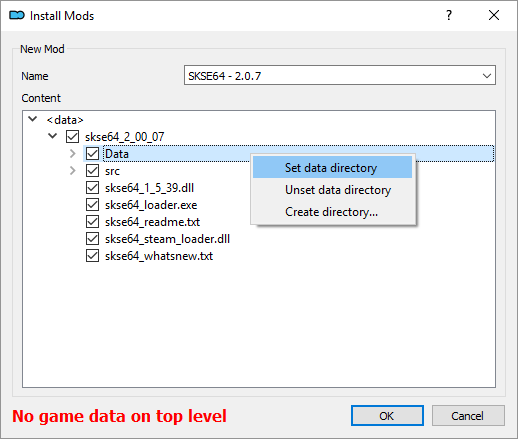
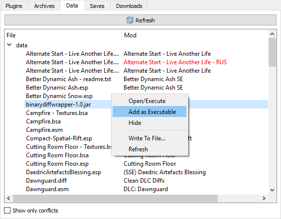

# Технические детали

В: Плагины постоянно отваливаются, и мне приходиться подключать всё заново при каждом действии.

О: Skyrim.ini (если стоит МО2 - открывать через его INI-редактор), секция [Launcher], bEnableFileSelection=1.

------

В: Если я запускаю игру через Mod Organizer 2, она открывается в маленьком окне, т.е. не на весь экран.

О: У MO2 свои инишники Skyrim.ini и SkyrimPrefs.ini для каждого профиля, поэтому используй его INI-редактор или загляни в папку профиля.

------

В: Ставлю мод через МО2, а он пишет "Нет игровых данных на верхнем уровне".

О: Ищешь в открытом моде папку Data, кликаешь правой кнопкой и выбираешь "Set data directory":

------

В: Другие программы не видят моды, которые я установил через МО2.

О: Программы, которые в процессе работы обращаются к твоим модам (Wrye Bash, LOOT и т.д.) должны запускаться через МО2. Для этого программу нужно добавить в него: нажми на значок с двумя шестерёнками, после чего в поле "Binary" укажи полный путь к файлу программы. Если она была установлена через МО2, то в виртуальной папке Data (средняя вкладка) найди нужный файл (exe/jar/т.п.), сделай по нему правый клик и выбери "Add as Executable".

------

В: При запуска LOOT через МО2 появляется белый экран и больше ничего не происходит.

О: Пропиши в ярлыке LOOT в МО2 аргумент "--single-process" (без кавычек).

------

|[*Назад к оглавлению*](../01_Оглавление.md)|
|:---:|
