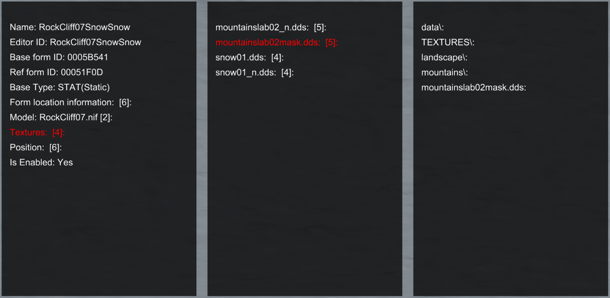

# Нахождение модели и текстур объекта

> Куда смотреть и что делать после того, как ты выделил объект в консоли? На примере ReferenceID 051F0D, RockCliff07SnowSnow.

## Простой способ

+ Требуется [More Informative Console](https://www.nexusmods.com/skyrimspecialedition/mods/19250), для "кликов" используй Shift.
+ В первом окне дополнительной информации кликни по "Model: RockCliff07.nif".
+ Далее кликай по Model > Model Path.
+ В итоге ты получишь данные вида "Landscape\Rocks\RockCliff07.nif".
    + 
    + В зависимости от записи в плагине, часть "Data\Meshes" может быть не указана. Тем не менее, она "подразумевается".
    + Итак, объект 051F0D использует модель "Data\Meshes\Landscape\Rocks\RockCliff07.nif".
+ В первом окне дополнительной информации кликни по "Textures".
+ Далее кликай по текстуре на выбор.
+ В итоге ты получишь данные вида "Data\Textures\Landscape\Mountains\MountainSlab02Mask.dds".
    + 
    + Заметим, что объект использует наложение текстур при помощи [TextureSet](https://ck.uesp.net/wiki/TextureSet), однако More Informative Console это не страшно, мод показывает именно те текстуры, которые используются.
    + В зависимости от объекта, часть "Data\Textures" может быть не указана. Тем не менее, она "подразумевается".
    + Итак, объект 051F0D использует следующие текстуры:
        + Data\Textures\Landscape\Mountains\MountainSlab02_n.dds
        + Data\Textures\Landscape\Mountains\MountainSlab02Mask.dds
        + Data\Textures\Landscape\Snow01.dds
        + Data\Textures\Landscape\Snow01_n.dds

------

|[*Назад к оглавлению*](../01_Оглавление.md)|
|:---:|
