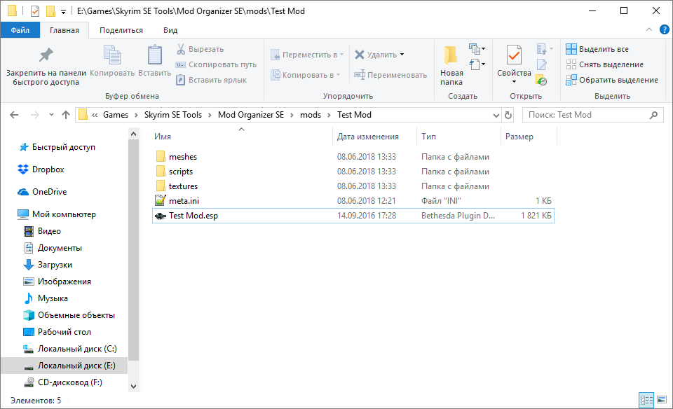

# Конвертация модов

Краткая справка для желающих перенести мод с SLE на SSE.

------

#### Шаг 1.
**Из чего состоит оригинал.**

Для начала установи мод в MO2 и посмотри, находятся ли его ресурсы в архиве (формат .bsa) или в свободном виде (т.н. loose-файлы). Если в моде есть архив, его нужно распаковать - для этого хорошо подходит утилита [B.A.E.](https://www.nexusmods.com/fallout4/mods/78/), у которой даже есть [видео-гайд от GamerPoets](https://www.youtube.com/watch?v=hw8PFGjgxYc).

Распаковывай в папку с модом в MO2, после чего удали архив.

Если мод состоит из одного esp-файла, то переходи сразу к [Шагу 3](#Шаг-3).

------

#### Шаг 2.
**Обработка ресурсов.**

Итак, у тебя есть loose-файлы мода, разложенные по папкам. В основном это:
+ meshes
+ textures
+ scripts
+ sound
+ SKSE

Подробнее о каждой.

2.1) **Meshes** - это папка с моделями для игры. К сожалению, в SSE Беседка сильно изменила конструкцию моделей, сделав один BSTriShape вместо NiTriShape и NiTriShapeData. Поэтому тебе скорее всего придётся воспользоваться утилитой [SSE NIF Optimizer](https://www.nexusmods.com/skyrimspecialedition/mods/4089/). Если она не в твоём вкусе, посмотри на [Cathedral Assets Optimizer](https://www.nexusmods.com/skyrimspecialedition/mods/23316).
+ Открой папку Meshes и проверь, есть ли там папка с т.н. HeadParts. Это волосы/бороды, головы и всё подобное.
+ Если нет, закинь исполняемый файл в папку Meshes и запусти его. Параметры по умолчанию подходят большинству, просто нажми Optimize.

    

+ Если же в моде есть причёски, модели голов и т.п. то тебе придётся использовать оптимизатор отдельно в каждой подпапке. Там, где есть эти элементы, не забудь ставить в оптимизаторе галочку "Head Parts Only". Главный принцип - оптимизировать HeadParts только с галкой, а остальное - без галки. Будь аккуратен.
+ Также в этой папке могут находиться анимации - файлы формата HKX. В новом Creation Kit 64 помимо прочего есть инструмент, который позволяет конвертировать их, подробнее - в [этом гайде](https://www.nexusmods.com/skyrimspecialedition/mods/2970).

2.2) **Textures** - это папка с текстурами. К счастью, Беседка не стала отказываться от формата DXT5 в угоду новому BC7 (почитать про него можно [на Реддите](https://www.reddit.com/r/skyrimmods/comments/5h6c0p/texture_compression_and_you_skyrim_se_edition/)), поэтому исправлять текстуры как правило не нужно. Только если они не в TGA (но это встречается крайне редко), в этом случае их нужно конвертировать в DDS, непрозрачные - в формат DXT1 или BC7, с прозрачностью - в DXT5 или BC7.
+ Также не забудь снова воспользоваться SSE NIF Optimizer, он может просканировать текстуры на предмет ошибок. Каких? Метод сжатия, например, коротко об этом написано [здесь](https://forums.nexusmods.com/index.php?/topic/5077930-skyrim-se-texture-formats-question/?p=44708080). Заветное сообщение - ошибок не найдено.  

      

+ Если же они будут, исправь их (да хоть в Paint.NET, он поддерживает .dds "из коробки").

2.3) **Scripts** - это папка со скриптами - сценариями игры на языке Papyrus. Работа скриптов в игре пракически не изменилась (в основном Скайриму просто добавили несколько новых функций и эвентов), так что их тоже можно не трогать.

2.4) **Sounds** - звуки. Голоса или просто звуки чего-либо - всё это осталось в тех же форматах. Не нуждается в конвертации.

2.5) **SKSE** - бей тревогу, мод содержит что-то относящееся к SKSE (да ладно?), и если это плагин (DLL-библиотека), то работать на SSE он не будет. Ты можешь раздобыть исходный код этой крутой штуки и попробовать конвертировать её под SKSE64, но тебе понадобятся знания и софт по C++. Поверь мне, это сложно.

------

#### Шаг 3.
**Обработка плагина.**

2.1) Плагин должен иметь подходящую кодировку. SSE использует UTF-8, поэтому для кодировок, отличных от 1252, есть смысл перевести плагин в UTF-8 сразу. Это касается в первую очередь русскоязычных модов (в т.ч. переводов с английского). Для этого используй [xTranslator](https://www.nexusmods.com/skyrimspecialedition/mods/134/).

+ Запусти его в режиме SkyrimSE, загрузи в него плагин и согласись использовать среду SkyrimSE.

    

+ Укажи оригинальную кодировку (справа вверху). Для русского языка это 1251. Если все строки читаемы, сохраняй плагин - он примет кодировку UTF-8.

    

2.2) Теперь тебе потребуется новый Creation Kit 64. Скачай его у Беседки или своруй откуда-нибудь ещё. Главное - это актуальная версия. Загрузи плагин в CK64 как активный, а когда всё будет готово - просто сохрани его (пересохрани).

> Для чего это нужно? Для смены Form Version и правильной обработки игрой записей. Подробнее читай [здесь](https://www.reddit.com/r/skyrimmods/comments/5lyvf6/actual_relevance_of_forms_4344/).

Если в плагине были NPC, после этого в папке Overwrite MO2 появятся сгенерированные модели и текстуры голов. Перемести их оттуда в папку мода.

------

#### Шаг 4.
**Тестирование в игре.**

Думаю, здесь всё понятно, подключаешь плагин (если ещё не подключен) и начинаешь играть. Не перезаписывай старые сохранения (которые без конвертированного мода), чтобы всегда можно было вернуться к ним в случае проблем.

------

Если у тебя ещё остались вопросы, или что-то не получается, читай/смотри гайды:
+ [Darkfox127](https://www.youtube.com/watch?v=iOmMIr9ngTs) - обширно и понятно.
+ [Dirty Weasel Media](https://www.youtube.com/playlist?list=PLWMvEg2LxwXZLmwvxUGBayGrTSVxQfs1-) - начиная с 9-го видео.
+ [Langeston](https://www.nexusmods.com/skyrimspecialedition/mods/17990/) - коротко и просто.

По вопросам конвертации Dual Sheath Redux и одежды с физикой (HDT) загляни в [Обучающие материалы](04_Обучающие_материалы.md).

Также загляни в тему [Проблемы и особенности конвертации модов](06_Проблемы_и_особенности_конвертации_модов.md), если хочешь знать о некоторых подводных камнях в этом деле.

------

|[*Назад к оглавлению*](../01_Оглавление.md)|
|:---:|
