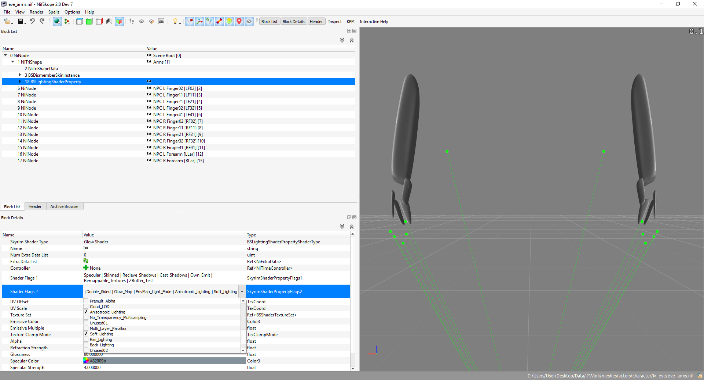

# Конвертация модов (Дополнения)

Ситуации, описанные в данном разделе, являются исключениями из правил, поэтому в большинстве случаев при работе с модами можно обходиться общими рекомендациями по конвертированию.

Независимо от специфики мода необходимо придерживаться нескольких правил, на каждое из которых ниже будет приведён практический пример.

------

1) По возможности проверять работоспособность мода на оригинальной версии игры, а если её нет, знакомиться со списком баг-трекера в разделе "Bugs" и читать отзывы в теме, посвящённой этому моду. Бывает так, что мод неработоспособен даже на оригинальной версии игры, поэтому поиск проблемы именно в процессе конвертирования является бесполезным.

2) Работать не с модом непосредственно, а с его копией. Например, создать временный мод путём копирования и дать ему соответствующее название: "armor" – наш оригинальный мод и "armor_wip" – непосредственно конверсия. Это является важным пунктом, поскольку из-за ошибки пользователя или особенностей мода иногда приходится либо задействовать обе версии, либо проводить конверсию с самого начала.

3) Неважно, насколько простым выглядит мод, после конвертирования необходимо проверять его работоспособность. Даже если это простая одежда – модели, переделанные с неправильными опциями, могут приводить к CTD.

    Наиболее полезными для тестирования инструментами являются мод на добавление вещей (AddItemMenu) и консольные команды player.additem и player.placeatme. Цифровую же часть довольно легко узнать через xEdit. Если приходится работать с модом, меняющим скопом много объектов (например, реплейсер NPC), неплохим подспорьем окажется скрипт для xEdit "Automation Tools" и команда bat.

4) Опять же, нужно учитывать специфику мода – может показаться, что он работает не так, как ты ожидал, но по факту это будет не ошибкой, а просто его реализацией.

5) В некоторых случаях окно "Warnings" в Creation Kit может стать неплохой отправной точкой. Поэтому, если оно появилось во время пересохранения плагина или попытке рендера какого-то объекта, не спешите его закрывать.

6) Обязательно до и после конвертации необходимо проверять плагин на наличие ошибок через xEdit.

------

**Следуя этим правилам, вы избавите себя от некоторой части проблем, которые в противном случае могут оказаться довольно времязатратными. Теперь разберём некоторые ситуации, встречающиеся в процессе конвертации.**

------

1) Если мод содержит модели, обладающие анимированными частями, вместо желаемого объекта мы сможем увидеть лишь серые контуры. Для разбора прибегнем к моду [M.A.R.I. - Advanced Companion Mod](https://www.nexusmods.com/skyrim/mods/91686).

    Если данный мод запустить лишь с обычной конвертацией моделей, в игре мы получим это:

    

    Чтобы избежать подобного, нам необходимо открыть каждый некорректно отображающийся в игре nif-файл, находящийся в папке meshes, и проверить его на наличие следующих флагов: **Anisotropic_Lighting** и **Soft_Lighting**. При их наличии - снять с них галочку. Следует также учесть, что подобную процедуру необходимо проводить не только для каждой модели, но и для каждой её части, обозначающейся как NiTriShape (или BsTriShape). В зависимости от модели, частей может быть намного больше, чем одна.

    

    После данной процедуры мы получим это:

    

2) Из-за того, что CK64 не закрепляет за плагином мастер-файлы без флага ESM, во время конвертации самого плагина может потеряться часть данных. Как пример, разберём патч совместимости между [Exchange currency](https://www.nexusmods.com/skyrimspecialedition/mods/491) и [The Golden Crossroads - Money Exchange](https://www.nexusmods.com/skyrim/mods/54670). Так как второго мода пока нет для SSE, нам придётся брать его со странички LE: [Exchange currency](https://www.nexusmods.com/skyrim/mods/67504). В данном случае нас интересует файл "Patch02 for The Golden Crossroads".

    Как мы видим, на данный момент плагин имеет Form Version 43, и ошибок в нём нет.

    

    Однако после пересохранения в CK64 мы видим предупреждения об отсутствующих данных (заметим, как из списка пропали esp-плагины).

    

    В таком случае их необходимо вручную скопировать любым удобным для пользователя путём при помощи xEdit. Самый простой способ - это скопировать их из исходного плагина при помощи "Copy as override (with overwritting) into". Возвращаясь к вышеописанным правилам, для того, чтобы одновременно загрузить обе версии мода, нам понадобится временно переименовать плагин, который мы только что сконвертировали. Назовём его "SL99Exchanger_Patch_BanknoteSeller_wip.esp". После этого ошибки исчезнут.

    

3) Проблемы могут возникнуть при конвертировании NPC, использующих много кастомных ресурсов. Для разбора этого случая мы используем мод 
[Tiny Serana and adoptable children plus Babette](https://www.nexusmods.com/skyrim/mods/65155). Хотя автор в секции файлов и указывает, что мод "Special edition compatible", но по отчёту xEdit и NIF Optimizer можно увидеть, что он не конвертирован (тем более, что он находится в секции для SLE).

    Если сконвертировать модели и затем войти в игру, то затронутые NPC будут отображаться корректно:

    

    Однако, стоит нам пересохранить плагин в Creation Kit, происходит следующее:

    

    Чтобы избежать подобного, необходимо после конвертации FaceGenData (и до пересохранения плагина) сделать бэкап этих данных на случай перезаписи. Таким образом, у нас будет 2 набора моделей - один оригинальный после конвертации, другой экспортированный от CK64. Узнать, какой из них лучше, можно только на практике (в игре).

4) Некоторые моды могут обладать проблемами вовсе не из-за конвертации, а из-за недочётов даже в оригинале. Как пример, рассмотрим мод, добавляющий броню [ХNyx suit from Appleseed alpha](https://www.nexusmods.com/skyrim/mods/77184/). Его проблема состоит в том, что при сохранении происходит вылет игры на рабочий стол. И в разделе "Bugs" об этом говорится. Выходом из ситуации будет не просто конвертация, но также и работа с плагином в xEdit. В данном случае наиболее надёжным вариантом станет удаления всех записей, которые не связаны напрямую с бронёй. Учитывая, что этот мод требует HDT High Heels, к стабильности которого имеются претензии, неплохим вариантом действий станет удаление записей, связанных и с ним.

5) При конвертировании некоторых модов (чаще всего брони), действуя стандартными настройками NIF Optimizer, в игре можно получить CTD. Для этого рассмотрим [zzjay's Skyrim Attire V2](https://www.dropbox.com/s/1asj3tby6gt6764/Skyrim%20Attire.7z?dl=0). После конвертации вся одежда будет отображаться корректно, но только не "Elizabeth Vest" (когда очередь дойдёт до неё, случится вылет). Экспериментальным путём можно придти к выводу, что подобное случается, если автор планировал/использует модель в качестве части будущего компаньона. Сам же вылет связан с конвертацией NiTriShape в BSTriShape. Это стандартное изменение для моделей одежды, однако в данном случае необходимо выполнить его не через Nif Optimizer, а используя [NiTriShape Converter (Optimizer)](https://www.nexusmods.com/skyrimspecialedition/mods/19911).

------

|[*Назад к оглавлению*](../01_Оглавление.md)|
|:---:|
