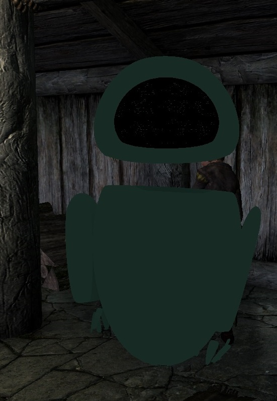
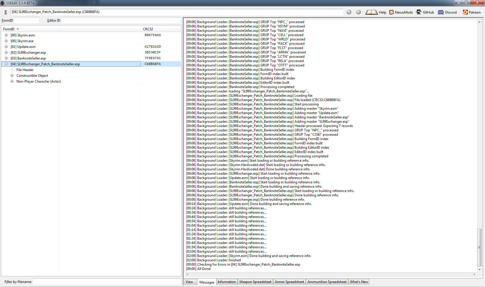
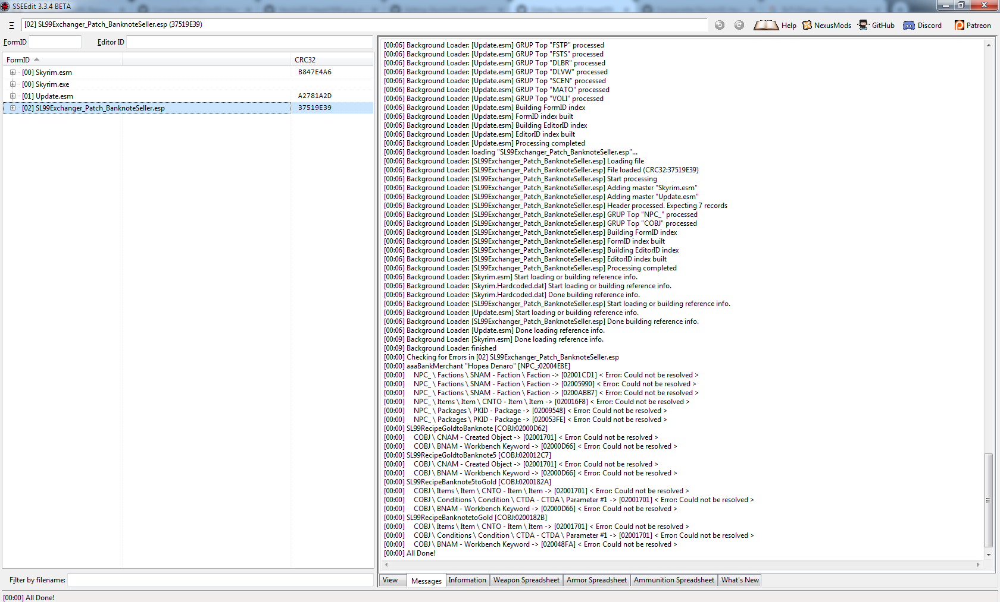
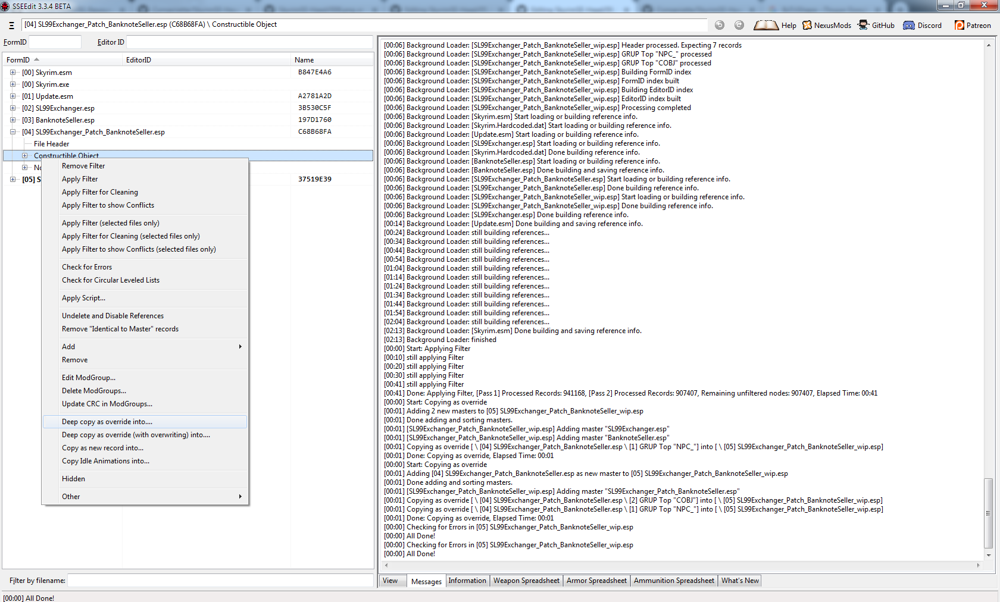

Ситуации описанные в данном разделе являются исключениями из правил, посему в большинстве случаев при работе с модами можно обходиться общими рекомендациями по конвертированию.
Независимо от специфики мода необходимо придерживаться нескольких правил, на каждое из которых ниже будет приведён практический пример.
1.	При возможности проверить его работоспособность на оригинальной версии игры, однако если её нет, ознакомиться со списком багтрекера в разделе "Bugs" и прочесть отзывы в теме посвящённой этому моду. Бывает так, что мод неработоспособен даже на оригинальной версии игры, посему поиск проблемы именно в процессе конвертирования является бесполезным. 
2.	Работать не с модом непосредственно, но с его копией. Например, создать временный мод путём копирования и дать ему соответствующее название: "armor" – наш оригинальный мод и "armor_wip" – непосредственно конверсия. Это является важным пунктом поскольку из-за ошибки пользователя или особенностей мода иногда приходится либо задействовать обе версии либо проводить конверсию с самого начала. 
3.	Неважно насколько простым выглядит мод, после конвертирования обязательно проверить его работоспособность. Даже если это простой аутфит – меши переделанные с неправильными опциями могут приводить к CTD.
Наиболее полезными для тестирования инструментами являются мод на добавление вещей и консольные команды player.additem и player.placeatme. Цифровую же часть довольно легко узнать через xEdit. Если приходится работать с модом меняющим скопом много объектов (например, реплейсер NPC), неплохим подспорьем окажется скрипт для xEdit "Automation Tools" и команда bat.
4.	Опять же, учитывайте специфику мода – может показаться, что он работает не так, как мы ожидали, но это по факту это будет не ошибкой, а просто его реализацией.
5.	В некоторых случаях окно "Warnings" в Creation Kit может стать неплохой отправной точкой. Поэтому если оно появилось во время пересохранения плагина или попытке рендера какого-то объекта, не спешите его закрывать.
6. Обязательно до и после конвертации проверяйте плагин на наличие ошибок через xEdit.

Следуя этим правилам, мы избавим себя от некоторой части проблем, которые в противном случае могут оказаться довольно времязатратными. Теперь разберём некоторые ситуации встречающиеся в процессе конвертации.

1.	Если мод содержит меши обладающие анимированными частями, вместо желаемого объекта мы можем увидеть лишь серые контуры. Для разбора прибегнем к моду [M.A.R.I. - Advanced Companion Mod](https://www.nexusmods.com/skyrim/mods/91686)

Если данный мод запустить лишь с обычной конвертацией мешей, в игре мы получим 

Чтобы избежать подобного, нам необходимо открыть каждый некорректно отображающийся в игре nif файл находящийся в папке meshes и проверить его на наличие следующих флагов: Anisotropic_Lighting, Soft_Lighting. При их наличии - снять с них галочку. Следует так же учесть,что подобную процедуру необходимо проводить не только для каждого меша, но и так же для каждой его части обозначающейся как NiTriShape (либо BsTriShape). В зависимости от меша, их может быть намного больше, чем одна.

После данной процедуры мы получим

2. По непонятным причинам во время конвертации самого плагина может потеряться часть данных. Как пример, разберём патч совместимости между [Exchange currency](https://www.nexusmods.com/skyrimspecialedition/mods/491) и [The Golden Crossroads - Money Exchange](https://www.nexusmods.com/skyrim/mods/54670/). Так как второго мода нет пока для SSE, нам придётся брать его со странички LE:[Exchange currency](https://www.nexusmods.com/skyrim/mods/67504). В данном случае нас интересует файл Patch02 for The Golden Crossroads.
Как видим, на данный момент хотя плагин и имеет Form Version 43, ошибок в нём нет.

Однако после пересохранения в CK мы видим предупреждения о отсутствующих данных.

В таком случае их необходимо вручную скопировать любым удобным для пользователя путём при помощи xEdit. Самый простой способ это удалить категории имеющие ошибки, а затем скопировать их из исходного плагина при помощи "Deep copy as override into". Возвращаясь к вышеописанным правилам, для того, чтобы одновременно загрузить обе версии мода, нам понадобится временно переименовать плагин, который мы только что сконвертировали. Назовём его "SL99Exchanger_Patch_BanknoteSeller_wip.esp". После этого ошибки исчезнут.

