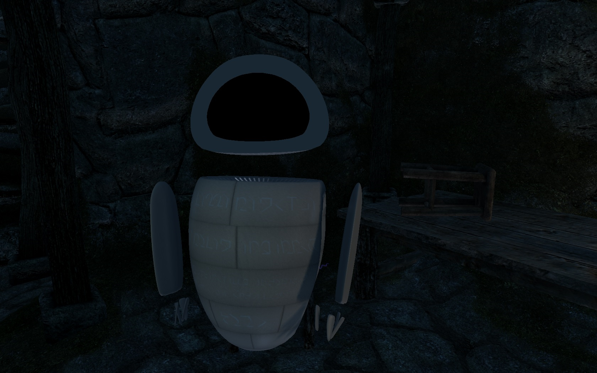
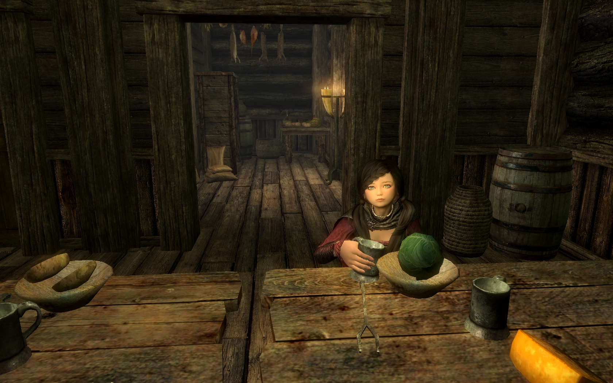
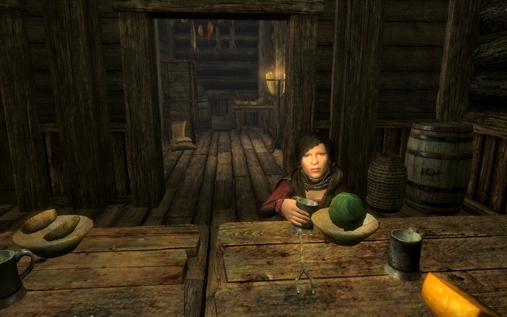

# Проблемы и особенности конвертации модов

Ситуации, описанные в данном разделе, являются исключениями из правил, поэтому в большинстве случаев при работе с модами можно обходиться общими рекомендациями по конвертированию.

Независимо от специфики мода необходимо придерживаться нескольких правил, на каждое из которых ниже будет приведён практический пример.

------

1) По возможности проверять работоспособность мода на оригинальной версии игры, а если её нет, знакомиться со списком баг-трекера в разделе "Bugs" и читать отзывы в теме, посвящённой этому моду. Бывает так, что мод неработоспособен даже на оригинальной версии игры, поэтому поиск проблемы именно в процессе конвертирования является бесполезным.

2) Работать не с модом непосредственно, а с его копией. Например, создать временный мод путём копирования и дать ему соответствующее название: "armor" – наш оригинальный мод и "armor_wip" – непосредственно конверсия. Это является важным пунктом, поскольку из-за ошибки пользователя или особенностей мода иногда приходится либо задействовать обе версии, либо проводить конверсию с самого начала.

3) Неважно, насколько простым выглядит мод, после конвертирования необходимо проверять его работоспособность. Даже если это простая одежда – модели, переделанные с неправильными опциями, могут приводить к CTD.

    Наиболее полезными для тестирования инструментами являются мод на добавление вещей (AddItemMenu) и консольные команды player.additem и player.placeatme. Цифровую же часть довольно легко узнать через xEdit. Если приходится работать с модом, меняющим скопом много объектов (например, реплейсер NPC), неплохим подспорьем окажется скрипт для xEdit "Automation Tools" и команда bat.

4) Опять же, нужно учитывать специфику мода – может показаться, что он работает не так, как ты ожидал, но по факту это будет не ошибкой, а просто его реализацией.

5) В некоторых случаях окно "Warnings" в Creation Kit может стать неплохой отправной точкой. Поэтому, если оно появилось во время пересохранения плагина или попытке рендера какого-то объекта, не спешите его закрывать.

6) Обязательно до и после конвертации необходимо проверять плагин на наличие ошибок через xEdit.

#### Следуя этим правилам, вы избавите себя от некоторой части проблем, которые в противном случае могут оказаться довольно времязатратными. Теперь разберём некоторые ситуации, встречающиеся в процессе конвертации.

1) Если мод содержит модели, обладающие анимированными частями, вместо желаемого объекта мы сможем увидеть лишь серые контуры. Для разбора прибегнем к моду [M.A.R.I. - Advanced Companion Mod](https://www.nexusmods.com/skyrim/mods/91686).

    Если данный мод запустить лишь с обычной конвертацией моделей, в игре мы получим это:

    

    Чтобы избежать подобного, нам необходимо открыть каждый некорректно отображающийся в игре nif-файл находящийся, в папке meshes и проверить его на наличие следующих флагов: **Anisotropic_Lighting** и **Soft_Lighting**. При их наличии - снять с них галочку. Следует также учесть, что подобную процедуру необходимо проводить не только для каждой модели, но и для каждой её части, обозначающейся как NiTriShape (или BsTriShape). В зависимости от модели, частей может быть намного больше, чем одна.

    

    После данной процедуры мы получим это:

    

2. По непонятным причинам во время конвертации самого плагина может потеряться часть данных. Как пример, разберём патч совместимости между [Exchange currency](https://www.nexusmods.com/skyrimspecialedition/mods/491) и [The Golden Crossroads - Money Exchange](https://www.nexusmods.com/skyrim/mods/54670/). Так как второго мода нет пока для SSE, нам придётся брать его со странички LE:[Exchange currency](https://www.nexusmods.com/skyrim/mods/67504). В данном случае нас интересует файл Patch02 for The Golden Crossroads.
Как видим, на данный момент хотя плагин и имеет Form Version 43, ошибок в нём нет.

Однако после пересохранения в CK мы видим предупреждения о отсутствующих данных.

В таком случае их необходимо вручную скопировать любым удобным для пользователя путём при помощи xEdit. Самый простой способ это удалить категории имеющие ошибки, а затем скопировать их из исходного плагина при помощи "Deep copy as override into". Возвращаясь к вышеописанным правилам, для того, чтобы одновременно загрузить обе версии мода, нам понадобится временно переименовать плагин, который мы только что сконвертировали. Назовём его "SL99Exchanger_Patch_BanknoteSeller_wip.esp". После этого ошибки исчезнут.

3. Проблемы могут возникнуть при конвертировании NPC использующих много кастомных ресурсов. Для разбора этого случая мы используем мод 
[Tiny Serana and adoptable children plus Babette](https://www.nexusmods.com/skyrim/mods/65155). Хотя автор в секции файлов и указывает, что мод "(Special edition compatible)", но по отчёту xEdit и nif optimizer можно увидеть, что он не конвертирован (тем более, что он находится в секции Legendary Edition). Если сконвертировать меши и затем войти в игру, то NPC добавленные в игру будут отображаться корректно.

Однако, стоит нам пересохранить плагин в Creation Kit и происходит следующее:

Дабы избежать подобного необходимо создать временную папку с модом, куда скопировать лишь конвертируемый плагин. Оригинальный же мод в идеале необходимо отключить в левой панели Mod Organizer - это позволит полностью исключить возможность перезаписи ресурсов, за исключением esp. В дальнейшем действовать по обычной схеме: загрузить плагин, пересохранить, перебросить из временной в оригинальную папку мода. Получившиеся в результате пересохранения файлы в Overwrite удалить.

4. Некоторые моды могут обладать проблемами вовсе не из-за конвертации, они имели недочёты даже в оригинале. Как пример, рассмотрим мод добавляющий броню [ХNyx suit from Appleseed alpha](https://www.nexusmods.com/skyrim/mods/77184/). Его проблема состоит в том, что при сохранении происходил вылет игры на рабочий стол. В разделе "Bugs" о этом говорится. Выходом из ситуации будет не просто конвертация, но так же и работа с плагином в xEdit. В данном случае наиболее надёжным вариантом станет удаления всех записей, которые не связаны напрямую с бронёй. Учитывая, что мод требует мастером HDT High Heels, к стабильности которого имеются претензии, неплохим вариантом действий станет удаления записей связанных и с ним.

5. При конвертировании некоторых модов (чаще всего аутфитов) действуя стандартными настройками Nif Optimizer в игре можно получить CTD. Для этого рассмотрим [zzjay's Skyrim Attire V2](https://www.dropbox.com/s/1asj3tby6gt6764/Skyrim%20Attire.7z?dl=0). После конвертации все аутфиты будут отображаться корректно, за исключением Elizabeth Vest (когда очередь дойдёт до него, случится вылет). Экспериментальным путём можно придти к выводу, что подобное случается, если автор планировал/использует меш в качестве части будущего компаньона. Сам же вылет связан с конвертацией NiTriShape в BSTriShape. Это изменение стандартное для аутфитов, однако в данном случае необходимо выполнить его не через Nif Optimizer, а [NiTriShape Converter (Optimizer)](https://www.nexusmods.com/skyrimspecialedition/mods/19911).
